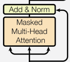
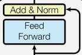

# tic-tac-transformer

## Article

### Project Proposal
- Project Motivation

### Tic Tac Toe Game
- Simple discription of the tic-tac-toe repo

### Data Collection
- Simulate all possible game states and record the best action

#### Min Max Algorithm
- Explain Min Max Trees

### Data Loaders

### Model Architechture
Below is the transformer model architechture from the now famous ["Attention Is All You Need"](https://arxiv.org/pdf/1706.03762) paper. For the purpose of this article, we will be focusing on the right block of the graph which is known as the Decoder block. The left block is what is known as the Encoder block.

In order to explain the architecture we will use a toy problem to explain the basic ontrol flow.

***Come Back and insert basic control flow example***

<div style="text-align:center"></div>

Now that we have a basic understanding of what the figure means we can explain the control flow of how our tic-tac-toe solver will work. Below I have added an image of what our decoder architecture will more closely resemble.

<div style="text-align:center"></div>

#### Multihead Attention
<div style="text-align:center"></div>

The Masked Multi-Head Attention block consists of multiple attention heads stacked together. Below I included the code for the attention head and multi-head attention. ***Explain Code***

```Insert Attention Head```
```Insert Multi-Attention Head```

Now that the basic attention head is built we can add the "Add & Norm" layer as well as the residual connections. 

***Explain why layer norm is useful (add reference)***

***Explain why residual connetions are useful (add reference)***

<div style="text-align:center"></div>

```Insert Multi-Attention Head with residual and add ```

#### Feed Foward
<div style="text-align:center"></div>

The Feed Foward block is single MLP layer with a relu activation funtion to add non linearity. ***Explain why non-linear is important***

```Insert Feed Foward Code```

The importance/usefulness of "Add & Norm" and residual connections is explained above in the Multihead Attention section. I will spare you the repeated explanation and include the diagram and code for the Feed Foward block with both implemented.

<div style="text-align:center"></div>

Now that the basic attention head is built we can add the "Add & Norm" layer as well as the residual connections. 

***Explain why layer norm is useful (add reference)***

***Explain why layer norm is useful (add reference)***

<div style="text-align:center"></div>

```Insert Feed Foward Code with residual```

#### Decoder Block

<div style="text-align:center"></div>


#### Model Parameters
- batch_size:
- vocab_size:
- num_embedding:
- num_heads:


### Training

#### Optimizer
#### LR Scheduler


### Experiments
