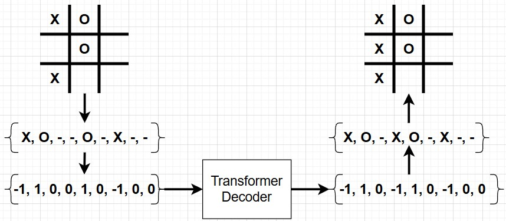

# tic-tac-transformer

The goal of this article is to implement a transformer decoder on a toy problem  to gain a better understanding of decoders. Tic-Tac-Toe was chosen as the toy problem mainly due to it not being NLP (Natural Language Processing). 

In order to complete this tasks there are a few things we need to do.

1. Implement Tic-Tac-Toe
2. Collect the Data
3. Implement the Transformer
4. Run experiments to see if it works

If you want to skip the article and read the code yourself, here is the [github repo](https://github.com/mullisd1/tic-tac-transformer)

## Tic Tac Toe Game

The first thing we need to do is to implement the tic-tac-toe game. This is a relatively simple affair with only a little bit of numpy. The repo for the game is [here](https://github.com/mullisd1/tic-tac-toe). The repo consists of 1 class that holds the boards state as well as some test to make sure the game works as intended. The repo also allows for game boards of greater than 3x3 in size. If you wanted to try to extend the work that I did here to larger boards feel free.

## Data
Now that the game is implemented, we have to define the problem space. This just means we have to define what our model inputs and outputs will be. In this case we have a 3x3 matrix where each position holds either a -1, 0, 1 (-1 = X, 0 = empty, 1 = O). In order to make this something the model understands we will transform this 3x3 matrix into a 1x9 matrix

<div style="text-align:center"></div>

very simple with numpy

``` python
>>> arr
array([[1, 2, 3],
       [4, 5, 6],
       [7, 8, 9]])
>>> arr.flatten()
array([1, 2, 3, 4, 5, 6, 7, 8, 9])
```

The current board state will serve as the model input, and the optimal next board state will serve as the model output, as seen in the picture below.

<div style="text-align:center"></div>

### Min Max Algorithm

A Minimax tree for Tic-Tac-Toe is a method of finding the best move assuming that the opponent is also trying to make their best move. The tree alternates between layers maximizing maximizing nodes and minimizing nodes. The AI assigns scores to terminal nodes (win = 1, loss = -1, draw = 0) and propagates these values upward. At each decision point, the algorithm selects the move leading to the best possible outcome. Training on this data ensures that our transformer will play optimally, making it either win or force a draw in an ideal game. If you would like a better more in depth explanation you can find one [here](https://philippmuens.com/minimax-and-mcts). 

Below is an example of how a min max tree works alternating between minimizing each layer (represents our opponents turn) and maximizing each layer (represents our turn)

<div style="text-align:center"></div>

This does come with one complication. In Tic-Tac-Toe there are often multiple moves that hold the same value. To deal with this we simply take the move that wins the quickest.

## Model Architecture

Below is the transformer model architecture from the now famous ["Attention Is All You Need"](https://arxiv.org/pdf/1706.03762) paper. We will start by focusing on the right block of the graph which is known as the Decoder block. The left block is what is known as the Encoder block.

A simple example of how the below architecture would work is a simple question answer model. A paragraph would be fed into the encoder, a question would be fed into the decoder, and the decoder output would be the answer to that question. 

<div style="text-align:center"></div>

In our toy problem of tic-tac-toe we are not providing any outside context. This means that we will not need the encoder on the left nor the cross attention layer. This leaves us with the model shown below.

<div style="text-align:center"></div>

### Model layers explained

Now I am going to explain each layer of the model, if you aren't interested you can skip straight to the training.

#### Multihead Attention

<div style="text-align:center"></div>

The Masked Multi-Head Attention block consists of multiple attention heads stacked together. An attention head computes an attention score for each input. This is done by using ***query, key, and value*** layers. The queries and keys calculate the attention weights via a dot product. This is then scaled by square root of the dimension size. The scaling is done so the softmax function does not behave oddly when there is high dimensionality (less important for our use case). The weights are then applied to the value matrix, producing a weighted sum that highlights the relevant information.

Below the Multi-Head Attention block is implemented. This is simply multiple attention heads running in parallel to extract different relationships from the data.

Dropout is included in the code below. Dropout is a simple process that while training the model will randomly turn off a percentage of the neurons. This allows for the model to generalize better during inference. For a better explanation look [here](https://towardsdatascience.com/dropout-in-neural-networks-47a162d621d9/)

```python
class Head(nn.Module):
    """ Singular Head"""

    def __init__(self,
                 num_embedding,
                 head_size,
                 dropout
                 ):
        super().__init__()
        self.key = nn.Linear(num_embedding, head_size, bias=False)
        self.query = nn.Linear(num_embedding, head_size, bias=False)
        self.value = nn.Linear(num_embedding, head_size, bias=False)

        self.dropout = nn.Dropout(dropout)

    def forward(self, x):
        # B: Batch Size
        # T: Number of Tokens
        # C: Number of channels (3 in this case for X, O, and empty)
        B,T,C = x.shape

        k = self.key(x) # (B,T,C)
        q = self.query(x) # (B,T,C)

        # Compute attention
        # C**0.5 is to make the numbers smaller so softmax doesn't do weird things
        wei = q @ k.transpose(-2, -1) / C**0.5 # (B, T, C) @ (B, C, T) -> (B, T, T)
        wei = F.softmax(wei, dim=-1)
        wei = self.dropout(wei)

        V = self.value(x)
        out = wei @ V # (B, T, T) @ (B, T, C) -> (B, T, C)
        return out
```
``` python
class MultiHeadAttention(nn.Module):
    """Multiple Attention Heads"""
    def __init__(self, num_heads, num_embedding, head_size, dropout):
        super().__init__()
        self.heads = nn.ModuleList([Head(num_embedding, head_size, dropout) for i in range(num_heads)])
        self.project = nn.Linear(num_embedding, num_embedding)                  # Projection layer for getting back into the residual pathway
        self.dropout = nn.Dropout(dropout)

    def forward(self, x):
        out = torch.cat([h(x) for h in self.heads], dim=-1)
        out = self.project(out)
        out = self.dropout(out)
        return out
```


### Feed Foward
<div style="text-align:center"></div>

The Feed Forward block is single MLP layer with a relu activation function to add non linearity. Non-linearity is crucial because it enables the model to learn complex patterns that a purely linear system cannot capture. If the feed-forward layer were only composed of linear transformations, stacking multiple layers would still be equivalent to a single linear transformation, limiting the model’s expressiveness.

```python
class FeedForward(nn.Module):
    """Single Layer"""

    def __init__(self, num_embedding, dropout):
        super().__init__()

        self.m = nn.Sequential(nn.Linear(num_embedding, 4 * num_embedding), # 4* because they did it in the paper
                               nn.ReLU(),
                               nn.Linear(4 * num_embedding, num_embedding),
                               nn.Dropout(dropout)
        )
    
    def forward(self, x):
        return self.m(x)
```

### Decoder Block

<div style="text-align:center"></div>

Now it is time to put it is time to put it all together into a decoder block. You will notice that I also added the residual connections and layer norm to the block. Residual connections help deal with the common issue of exploding and vanishing gradients. While layer norm addresses the internal covariant shift problem.

You can find better explanations for why we use [layer norm here](https://medium.com/@sujathamudadla1213/layer-normalization-48ee115a14a4) and [residual connections here](https://medium.com/towards-data-science/what-is-residual-connection-efb07cab0d55).

```python
class Block(nn.Module):
    """Transformer Block"""

    def __init__(self, num_embedding, num_heads, dropout):
        super().__init__()

        head_size = num_embedding // num_heads
        self.self_attn = MultiHeadAttention(num_heads, num_embedding, head_size, dropout)
        self.feed_fwd = FeedForward(num_embedding, dropout)

        self.lay_norm1 = nn.LayerNorm(num_embedding)
        self.lay_norm2 = nn.LayerNorm(num_embedding)

    def forward(self, x):
        x = x + self.self_attn(self.lay_norm1(x))
        x = x + self.feed_fwd(self.lay_norm2(x))
        return x
```

## Model Training

Now that we can build the model, we need to be able to train it. You will notice that I added somethings that are not strictly necessary but are nice to haves.

- Early Stopping:
    - stops training before the max number of epochs is reached because the validation loss has not gone down in 100 epochs (can be any number)
    - stops the model training when it begins to overfit
- LR Scheduler:
    - reduces the learning rate if the validation loss has not gone down in 30 epochs (can be any number)
    - allows for the use of a larger learning rate in the beginning so the model learns faster

```python
class ModelTrainer:
    def __init__(self, model,
                 train_dataloader,
                 val_dataloader, 
                 lr=1e-3,
                 epochs = 1000,
                 early_stopping = 20,
                 device = None):
        self.verbose = False

        self.model = model
        self.device = device if device is not None else ('cuda' if torch.cuda.is_available() else 'cpu')

        self.model.to(self.device)

        self.train_loader = train_dataloader
        self.val_loader = val_dataloader

        self.epochs = epochs
        self.early_stopping = early_stopping
        self.lr = lr
        self.optimizer = torch.optim.AdamW(model.parameters(), lr=self.lr)
        self.criterion = nn.CrossEntropyLoss() 
        self.scheduler = torch.optim.lr_scheduler.ReduceLROnPlateau(self.optimizer,
                                                                    mode='min',
                                                                    factor = 0.5,
                                                                    patience = 30)  # Reduce LR when learning stops

    def train_one_epoch(self):
        self.model.train()
        running_loss = 0.0
        
        for inputs, labels in tqdm(self.train_loader, desc="Training", unit="batch"):
            inputs, labels = inputs.to(self.device), labels.to(self.device)
            
            self.optimizer.zero_grad()  # Zero the gradients
            logits = self.model(inputs)
            
            loss = self.criterion(logits.view(-1, logits.size(-1)), labels.view(-1))
            loss.backward()  # Backpropagate the loss
            self.optimizer.step()  # Update model parameters
            
            running_loss += loss.item()
        
        avg_train_loss = running_loss / len(self.train_loader)
        return avg_train_loss
    
    def evaluate(self):
        self.model.eval()
        correct = 0
        total = 0
        running_loss = 0.0
        
        with torch.no_grad():  # No need to track gradients during evaluation
            for inputs, labels in self.val_loader: #tqdm(self.val_loader, desc="Evaluating", unit="batch"):
                inputs, labels = inputs.to(self.device), labels.to(self.device)
                logits = self.model(inputs)
                outputs = torch.argmax(logits, dim=2)
                
                loss = self.criterion(logits.view(-1, logits.size(-1)), labels.view(-1))
                running_loss += loss.item()
                
                total += labels.size(0)
                correct += (torch.all(outputs == labels, dim=1)).sum().item()
        
        avg_val_loss = running_loss / len(self.val_loader)
        accuracy = correct / total
        return avg_val_loss, accuracy
    
    def train(self):
        best_val_loss = np.inf
        train_losses = []
        val_losses = []
        
        for epoch in range(self.epochs):
            # print(f"Epoch {epoch+1}/{self.epochs}")
            train_loss = self.train_one_epoch()
            val_loss, val_accuracy = self.evaluate()

            train_losses.append(train_loss)
            val_losses.append(val_loss)
            
            if self.verbose:
                print(f"Train Loss: {train_loss:.4f}")
                print(f"Validation Loss: {val_loss:.4f}")
                print(f"Validation Accuracy: {val_accuracy * 100:.2f}%")
            
            # Save the best model based on validation accuracy
            if val_loss < best_val_loss:
                counter = 0
                best_val_loss = val_loss
                print("Saving best model...")
                torch.save(self.model.state_dict(), "./models/best_model.pth")
            else:
                counter += 1

            if counter > 50:
                print(f"Early stopping at Epoch {epoch}")
                break
        return train_losses, val_losses
```

## Experiments

Below I will list the experiments that were performed. For all of the experiments some of the config variables will remain constant.

```
vocab_size = 3 # number of tokens (X, O, empty)
block_size = 9 # board size
```

### Experiment 1: Initial Run

**Hypothesis**: To start off I trained with a relatively small model with no dropout to see if it could learn.
**Config**:
```
num_embedding = 32,
num_heads = 4,
num_blocks = 4,
dropout = 0.0
```
**Loss Graph**:
<div style="text-align:center"></div>

**Test Results**: 84.459% accuracy
**Analysis**: This model was able to learn to maintain the board position and only change 1 value. This model often still loses but it is clear that it was able to learn the rules of the game.

### Experiment 2: Add Dropout

**Hypothesis**: Dropout will help with the learning
**Config**:
```
num_embedding = 32,
num_heads = 4,
num_blocks = 4,
dropout = 0.1
```
**Loss Graph**:
<div style="text-align:center"></div>

**Test Results**: 92.229% accuracy
**Analysis**: Just by adding dropout to the training we were able to learn quite a bit more. This model also ran for 2.5x more epochs than the previous as it was able to continue learning.

### Experiment 3: Make the model wider

**Hypothesis**: Adding more heads will allow the model to learn better
**Config**:
```
num_embedding = 32,
num_heads = 8,
num_blocks = 4,
dropout = 0.1
```
**Loss Graph**:
<div style="text-align:center"></div>

**Test Results**: 94.932% accuracy
**Analysis**: The model does perform slightly better but still not as well as I hoped for.

### Experiment 4: Make the model wider

**Hypothesis**: Adding more heads will allow the model to learn better
**Config**:
```
num_embedding = 128,
num_heads = 8,
num_blocks = 4,
dropout = 0.1
```
**Loss Graph**:
<div style="text-align:center"></div>

**Test Results**: 96.621% accuracy
**Analysis**: I played this model in a few games. It always plays legal moves with good strategy. I believe the 3.4% test error is due to there often being more than 1 move in Tic-Tac-Toe that will lead to a win.


## Model Architecture Part 2

Now we will add the encoder and cross attention blocks back into the model. This toy problem does not lend itself well to the encoder-decoder architecture, but I am going to force it anyway.

The new control flow of the model is described below. The input to the encoder will be all possible next moves. Ideally this will mean we need less parameters and will train faster.

<div style="text-align:center"></div>

Below are the main code changes necessary to add the cross attention. Essentially the output of the encoder becomes the key and the value for the for the cross attention. The output of the masked multi-head attention then becomes the query value.

``` python
class Head(nn.Module):
    """ Singular Head"""
    def __init__(self,
                 num_embedding,
                 head_size,
                 dropout
                 ):
        super().__init__()
        self.key = nn.Linear(num_embedding, head_size, bias=False)
        self.query = nn.Linear(num_embedding, head_size, bias=False)
        self.value = nn.Linear(num_embedding, head_size, bias=False)

        self.dropout = nn.Dropout(dropout)
    
    def forward(self, x, x_k = None, x_v = None):
        # (CHANGES HERE)
        x_q = x
        x_k = x_k if x_k is not None else x
        x_v = x_v if x_v is not None else x
        
        B,T,C = x_q.shape

        k = self.key(x_k) # (B,T,C)
        q = self.query(x_q) # (B,T,C)

        # Computer attention
        # C**0.5 is to make the numbers smaller so softmax doesn't do weird things
        wei = q @ k.transpose(-2, -1) / C**0.5 # (B, T, C) @ (B, C, T) -> (B, T, T)
        wei = F.softmax(wei, dim=-1)
        wei = self.dropout(wei)

        V = self.value(x_v)
        out = wei @ V # (B, T, T) @ (B, T, C) -> (B, T, C)
        return out
    
class MultiHeadAttention(nn.Module):
    """Multiple Attention Heads"""
    def __init__(self, num_heads, num_embedding, head_size, dropout):
        super().__init__()
        self.heads = nn.ModuleList([Head(num_embedding, head_size, dropout) for i in range(num_heads)])
        self.project = nn.Linear(num_embedding, num_embedding)
        self.dropout = nn.Dropout(dropout)

    def forward(self, x, enc_out = None):
        if enc_out is None:
            out = torch.cat([h(x) for h in self.heads], dim=-1)
        else:
            out = torch.cat([h(x, x_k=enc_out, x_v=enc_out) for h in self.heads], dim=-1) # (CHANGES HERE)
        out = self.project(out)
        out = self.dropout(out)
        return out

class EncoderBlock(nn.Module):
    """EncoderBlock"""
    def __init__(self, num_embedding, num_heads, dropout):
        super().__init__()

        head_size = num_embedding // num_heads
        self.self_attn = MultiHeadAttention(num_heads, num_embedding, head_size, dropout)
        self.feed_fwd = FeedForward(num_embedding, dropout)

        self.lay_norm1 = nn.LayerNorm(num_embedding)
        self.lay_norm2 = nn.LayerNorm(num_embedding)

    def forward(self, x):
        x = self.lay_norm1(x + self.self_attn(x))
        x = self.lay_norm2(x + self.feed_fwd(x))
        return x
    

class DecoderBlock(nn.Module):
    """DecoderBlock"""
    def __init__(self, num_embedding, num_heads, dropout):
        super().__init__()

        head_size = num_embedding // num_heads
        self.self_attn = MultiHeadAttention(num_heads, num_embedding, head_size, dropout)
        self.cross_attn = MultiHeadAttention(num_heads, num_embedding, head_size, dropout)
        self.feed_fwd = FeedForward(num_embedding, dropout)

        self.lay_norm1 = nn.LayerNorm(num_embedding)
        self.lay_norm2 = nn.LayerNorm(num_embedding)
        self.lay_norm3 = nn.LayerNorm(num_embedding)

    def forward(self, x, encoder_out):
        x = self.lay_norm1(x + self.self_attn(x))
        x = self.lay_norm2(x + self.cross_attn(x, enc_out = encoder_out)) # CHANGE HERE
        x = self.lay_norm3(x + self.feed_fwd(x))
        return x


class TicTacToeModel(nn.Module):
    def __init__(self,
                 vocab_size,
                 en_block_size,
                 de_block_size,
                 num_embedding,
                 num_heads,
                 dropout,
                ):
        super().__init__()

        # Embeddings
        self.token_embedding_table = nn.Embedding(vocab_size,num_embedding)
        self.en_position_embedding_table = nn.Embedding(en_block_size, num_embedding)
        self.de_position_embedding_table = nn.Embedding(de_block_size, num_embedding)

        # Encoder (CHANGES HERE)
        self.encoder_1 = nn.Sequential(
            EncoderBlock(num_embedding, num_heads, dropout),
        )

        # Decoder (CHANGES HERE)
        self.encoder_2 = nn.Sequential(
            EncoderBlock(num_embedding, num_heads, dropout),
            # EncoderBlock(num_embedding, num_heads, dropout),
        )

        # Cross Attend (CHANGES HERE)
        self.cross_attn = DecoderBlock(num_embedding, num_heads, dropout)

        # Head (CHANGES HERE)
        self.head = nn.Sequential(
            # EncoderBlock(num_embedding, num_heads, dropout),
            nn.Linear(num_embedding, vocab_size)
        )


    def forward(self, en_in, de_in):
        _, en_T = en_in.shape
        B, de_T = de_in.shape

        token_embedding = self.token_embedding_table(en_in) # (B, T, C)
        position_embedding = self.en_position_embedding_table(torch.arange(en_T)) # (T, C)
        en_in = token_embedding + position_embedding # (B, T, C)

        en1_out = self.encoder_1(en_in)

        token_embedding = self.token_embedding_table(de_in) # (B, T, C)
        position_embedding = self.de_position_embedding_table(torch.arange(de_T)) # (T, C)
        de_in = token_embedding + position_embedding # (B, T, C)

        en2_out = self.encoder_2(de_in)

        x = self.cross_attn(en2_out, en1_out)

        logits = self.head(x) # (B, T, vocab_size)
   
        return logits

```

## Experiments Part 2

Below I will list the experiments that were performed. For all of the experiments some of the config variables will remain constant.

```
vocab_size = 3 # number of tokens (X, O, empty)
block_size = 9 # board size
encoder_block_size = 81 
```

### Experiment 1: Initial Run

**Setup**:
``` python
# Encoder
self.encoder_1 = nn.Sequential(
    EncoderBlock(num_embedding, num_heads, dropout),
)

# Decoder
self.encoder_2 = nn.Sequential(
    EncoderBlock(num_embedding, num_heads, dropout),
)

# Cross Attend
self.cross_attn = DecoderBlock(num_embedding, num_heads, dropout)

# Head
self.head = nn.Sequential(
    EncoderBlock(num_embedding, num_heads, dropout),
    EncoderBlock(num_embedding, num_heads, dropout),
    EncoderBlock(num_embedding, num_heads, dropout),
    EncoderBlock(num_embedding, num_heads, dropout),
    nn.Linear(num_embedding, vocab_size)
)
```

**Hypothesis**: Should see similar performance to best non cross-attention models
**Config**:
```
num_embedding = 32,
num_heads = 4,
num_encoder_blocks = 1,
num_encoder_blocks = 1,
dropout = 0.1
```
**Loss Graph**:
<div style="text-align:center"></div>

**Test Results**: 92.736% accuracy
**Analysis**: Performed comparably to models without cross-attention

### Experiment 3: Extra Context Encoding

**Setup**: 
``` python 
# Encoder
self.encoder_1 = nn.Sequential(
    EncoderBlock(num_embedding, num_heads, dropout),
    EncoderBlock(num_embedding, num_heads, dropout),
    EncoderBlock(num_embedding, num_heads, dropout),
    EncoderBlock(num_embedding, num_heads, dropout)
)

# Decoder
self.encoder_2 = nn.Sequential(
    EncoderBlock(num_embedding, num_heads, dropout),
    EncoderBlock(num_embedding, num_heads, dropout),
)

# Cross Attend
self.cross_attn = DecoderBlock(num_embedding, num_heads, dropout)

# Head
self.head = nn.Sequential(
    EncoderBlock(num_embedding, num_heads, dropout),
    nn.Linear(num_embedding, vocab_size)
)
```
**Hypothesis**: The extra parameters on the context will not make much difference
**Config**:
```
num_embedding = 32,
num_heads = 4,
dropout = 0.1
```
**Loss Graph**:
<div style="text-align:center"></div>

**Test Results**: 92.905% accuracy
**Analysis**: The extra parameters did not improve performance over a model without cross-attention.

### Experiment 4: 1 self-attention for each

**Setup**: Once self attention block for each input and 1 cross attention block
``` python 
# Encoder
self.encoder_1 = nn.Sequential(
    EncoderBlock(num_embedding, num_heads, dropout),
)

# Decoder
self.encoder_2 = nn.Sequential(
    EncoderBlock(num_embedding, num_heads, dropout),
)

# Cross Attend
self.cross_attn = DecoderBlock(num_embedding, num_heads, dropout)

# Head
self.head = nn.Sequential(
    nn.Linear(num_embedding, vocab_size)
)
```
**Hypothesis**: The model will be under parameterized
**Config**:
```
num_embedding = 32,
num_heads = 4,
num_encoder_blocks = 1,
num_decoder_blocks = 1,
dropout = 0.1
```
**Loss Graph**:
<div style="text-align:center"></div>

**Test Results**: 81.588% accuracy
**Analysis**: There was in fact less performance

### Experiment 5: Experiment 4 with more parameters
**Setup**: Once self attention block for each input and 1 cross attention block
``` python 
# Encoder
self.encoder_1 = nn.Sequential(
    EncoderBlock(num_embedding, num_heads, dropout),
)

# Decoder
self.encoder_2 = nn.Sequential(
    EncoderBlock(num_embedding, num_heads, dropout),
)

# Cross Attend
self.cross_attn = DecoderBlock(num_embedding, num_heads, dropout)

# Head
self.head = nn.Sequential(
    nn.Linear(num_embedding, vocab_size)
)
```
**Hypothesis**: The model will be improve but not be as good as deeper models
**Config**:
```
num_embedding = 128,
num_heads = 16,
num_encoder_blocks = 1,
num_decoder_blocks = 1,
dropout = 0.1
```
**Loss Graph**:
<div style="text-align:center"></div>

**Test Results**: 92.905% accuracy
**Analysis**: Adding more parameters improved the model greatly

## Conclusion:
In conclusion, a basic transformer without too many parameters can learn to play Tic-Tac-Toe decently well. If you want to play with this yourself, here is the link to my [COLAB Notebook](https://colab.research.google.com/drive/1FwYLa2WgWvTyCNczd5RJWR3N22K9sYdD?usp=sharing)
